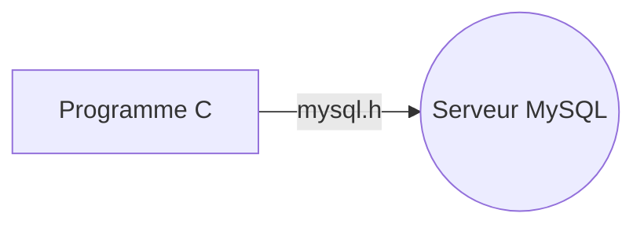

# Connection et requête SQL en C

Pour ce programme, nous aurons besoin d'utiliser la librairie `mysql.h` (se trouvant sur un système Linux sous `/usr/include/mariadb/mysql.h`, NB : pour inclure la lib, utiliser `#include <mariadb/mysql.h>`.


Voici le code pour se connecter et envoyer une requête SQL grâce à un code en C (pensez à modifier `*server, *user, *password et *database` : 
```c
#include  <stdio.h>
#include  <stdlib.h>
#include  <string.h>
#include  <mariadb/mysql.h>

  

int  main() {

	MYSQL  *conn;
	MYSQL_RES  *res;
	MYSQL_ROW  row;
	char  *server  =  "IPduServeur";
	char  *user  =  "utilisateur"; // Utilisateur de la base de données
	char  *password  =  "motdepasse"; // Mot de passe de la base de données
	char  *database  =  "database"; // Nom de la base de données
	conn  =  mysql_init(NULL);
	
	// Connexion à la base de données
	if (!mysql_real_connect(conn, server, user, password, database, 0, NULL, 0)) {
		fprintf(stderr, "%s\n", mysql_error(conn));
		exit(1);
	}
	
	// Demander à l'utilisateur d'entrer la requête SQL
	char  query[1000];
	printf("Entrez votre requête SQL : ");
	fgets(query, sizeof(query), stdin);

	// Supprimer le saut de ligne à la fin de la requête
	int  len  =  strlen(query);
	if (query[len  -  1] ==  '\n')
		query[len  -  1] =  '\0';
	
	// Exécution de la requête SQL
	if (mysql_query(conn, query)) {
		fprintf(stderr, "%s\n", mysql_error(conn));
		exit(1);
	}
	// Récupération et affichage des résultats
	res  =  mysql_use_result(conn);
	if (res) {
		while ((row  =  mysql_fetch_row(res)) !=  NULL) {
			for (int  i  =  0; i  <  mysql_num_fields(res); i++) {
				printf("%s ", row[i] ?  row[i] :  "NULL");
			}
			printf("\n");
		}
	mysql_free_result(res);
	}

	// Fermeture de la connexion
	mysql_close(conn);
	return  0;
}

```
## Configuration du serveur MariaDB pour accepter les connections distantes (dans le cas où le script n'est pas exécuter sur l'hôte du serveur SQL)

En essayant d'exécuter le programme ci-dessus, vous devriez sûrement tomber sur ce type d'erreur :


Je vais donc vous montrer comment configurer le serveur SQL afin d'accepter les requêtes distantes :

Tout d'abord, assurez-vous que les variables `skip-networking` soit bien à OFF et `bind-address` sur l'adresse IP de votre serveur.
Normalement, lorsque vous vous connectez au serveur en connection locale et que vous exécutez `SHOW VARIABLES LIKE 'skip_networking';` et `SHOW VARIABLES LIKE 'bind-address';` vous devriez récupérer ceci : 


Si vous avez ça, tout est bon pour la suite, nous allons donc pouvoir configurer un utilisateur d'accès distant sur notre serveur SQL ! 

### Premièrement, modification de la bind-address
Vous allez devoir modifier le fichier `/etc/mysql/mariadb.conf.d/50-server.cnf` afin d'y modifier la valeur de `bind-address`. Pour se faire exécutez la commande `nano /etc/mysql/mariadb.conf.d/50-server.cnf` et cherchez la ligne où il y'a écris `bind-address`. Modifiez cette ligne en remaplaçant 0.0.0.0 par l'adresse IP de votre serveur. Pour fermer et enregistrer, appuyez sur Ctrl+X puis tapez sur Y.
Redémarrez le serveur SQL à l'aide de la commande `systemctl restart mariadb` puis connectez vous.

#### Connexion à la console SQL.
Connectez vous ensuite à votre console SQL en utilisant `mysql -u root -p`, un mot de passe **(que vous aurez défini à l'installation de votre serveur SQL)** vous sera demandé. Vous devriez ensuite tomber sur cette console : 


Une fois que vous êtes connectés au serveur SQL, vous allez créer un utilisateur en lui octroyant l'accès, vous allez utiliser les commandes suivantes, en prêtant attention à modifier `utilisateur`, `basededonnees` et `motdepasse`.
Voici les commandes à exécuter unes par une :
* `CREATE USER 'utilisateur'@'localhost' IDENTIFIED BY 'motdepasse';`

* `GRANT ALL ON basededonnees.* to 'utilisateur'@'%' IDENTIFIED BY 'motdepasse' WITH GRANT OPTION;`

* `FLUSH PRIVILEGES;`

* `EXIT;`


Si tout ce passe bien, à l'exécution de chaque commande la console devrait vous renvoyer ceci : `Query OK, 0 rows affected (0.001 sec)`.


Maintenant, lorsque vous allez exécuter votre programme, en utilisant les identifiants que l'on vient tout juste de créer, vous devriez pouvoir envoyer une requête SQL comme ceci ! :


